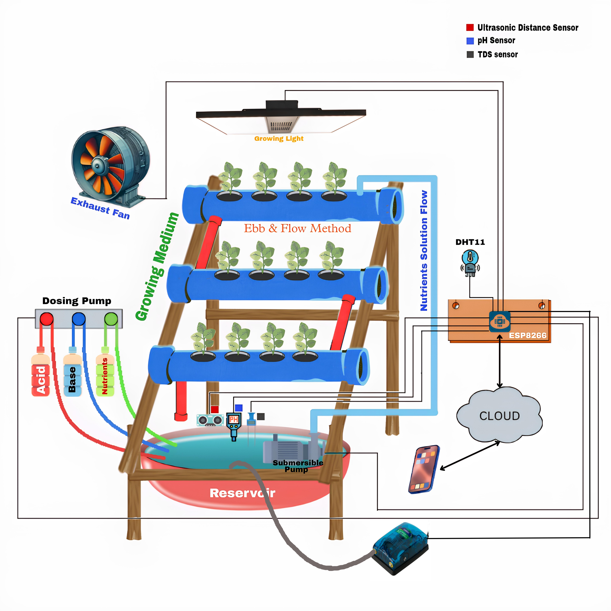

# AquaGrowX-System

## Authors
** DUNNA ANANDA SIDHVILAS **

## Overview  

Modern agriculture faces increasing challenges due to the **shrinking availability of arable land** and **unpredictable climatic conditions**. **AquaGrowX** is designed to counter these limitations by offering a **highly efficient, soil-free farming solution** through hydroponics.  

This **automated hydroponic system**, powered by **IoT technology**, allows for **precise monitoring and control** of essential growth parameters—such as **pH levels, nutrient composition, temperature regulation, and aeration**—to ensure optimal plant development. By leveraging **smart automation**, AquaGrowX significantly reduces human intervention while maximizing productivity.  

Designed for **versatility**, AquaGrowX enables seamless **indoor and outdoor cultivation**, making it ideal for home-based farming, research, and commercial applications. With its **real-time monitoring system**, users can track vital stats remotely via an intuitive **IoT dashboard**, ensuring full control of the growing environment from anywhere.  

Beyond automating hydroponic farming, AquaGrowX acts as a **powerful data-driven platform** for researchers, offering valuable insights into the relationships between environmental factors and plant health. As a **season-independent farming method**, it unlocks year-round cultivation, allowing users to grow fresh produce—regardless of external climate conditions! 🌱🚀  

## Components
Our **AquaGrowX-System** integrates various essential components:

- **ESP8266/ESP32 (Microcontroller)**
- **5V Relay Module**
- **pH Sensor**
- **TDS Sensor**
- **Temperature Sensor (DHT11)**
- **Ultrasonic Sensor (HC-SR04)**
- **Submersible Pump**
- **Dozing Pump**
- **Exhaust Fan**
- **Grow Light**
- **Air Pump**

---

## Features  

🌊 **AquaGrowX is engineered with intelligent automation**, redefining hydroponic farming by making it **effortless, precise, and future-ready**.  

  

✨ **Real-time automated pH & TDS adjustments** for optimized plant growth  
✨ **Precision-based nutrient delivery system** for effortless plant feeding  
✨ **Smart grow light management** adapting to day-night cycles  
✨ **Automated aeration system** for maintaining ideal humidity & temperature  
✨ **Dynamic oxygenation via air pump activation** for healthier root systems  
✨ **Complete remote control & monitoring** via **Blynk IoT integration**  

## How to Run This Project
Follow these steps to set up your **AquaGrowX-System**:

1. **Install Arduino IDE** and configure it for ESP8266/ESP32.
2. **Connect all sensors & actuators** to the microcontroller.
3. **Adjust threshold values** according to your preferences.
4. **Set up a Blynk template**, create a web dashboard, and configure datastreams.
5. **Upload the code** to your microcontroller.
6. **Power up the system** (microcontroller, sensors, and actuators).
7. Congratulations! 🎉 **Your AquaGrowX-System setup is now fully operational!** 🚀  

![PXL_20240418_063912559]AquaGrowX/img/pic2.jpg)

**Note:** If using **ESP8266**, you'll need **two microcontrollers**, as it has only **one analog pin** (and this project requires at least **two**). Alternatively, you can use an **Arduino UNO** but will need an **external Wi-Fi module**. The best option is to use **ESP32**, which comes with built-in Wi-Fi and sufficient analog pins.

---

This version adds a **dynamic and engaging touch**, making your **README.md** more **interactive and appealing**. What do you think? 😎🚀
